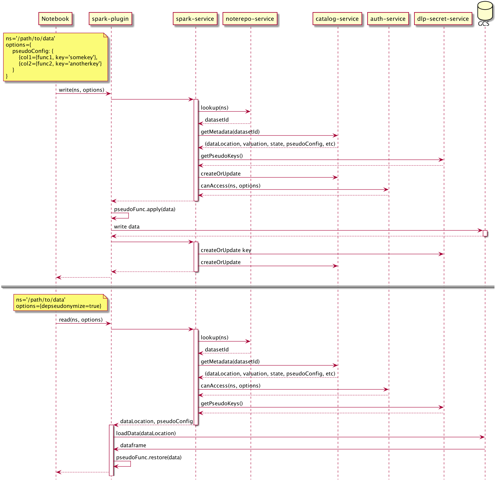

= Architecture

ifdef::env-github[]
:tip-caption: :bulb:
:note-caption: :information_source:
:important-caption: :heavy_exclamation_mark:
:caution-caption: :fire:
:warning-caption: :warning:
:toc-placement: preamble
endif::[]

== Sequence Diagram

ifdef::env-github[]

endif::[]

ifndef::env-github[]
plantuml::sequence-diagram.puml[format=svg, alt="Class diagram", width=300, height=200]
endif::[]

|===

