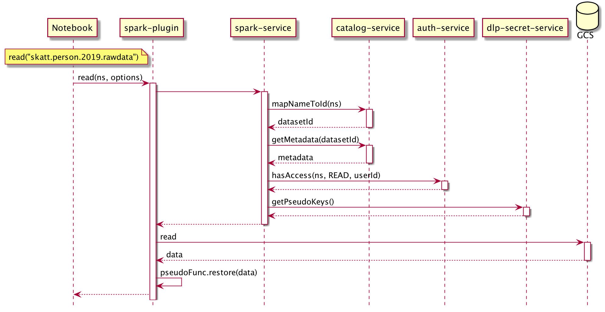

= Architecture

ifdef::env-github[]
:tip-caption: :bulb:
:note-caption: :information_source:
:important-caption: :heavy_exclamation_mark:
:caution-caption: :fire:
:warning-caption: :warning:
:toc-placement: preamble
endif::[]

== Component Diagram

ifdef::env-github[]
=== Components Overview
image::img/components.png[Components Overview,1024]
endif::[]

ifndef::env-github[]
=== Components Overview
plantuml::components.puml[format=svg, alt="Components Overview", width=1024]
endif::[]

== Sequence Diagram

ifdef::env-github[]
=== Data read success

=== Data write success
image::img/data_write_success.png[Data Write Success,1024]
endif::[]

ifndef::env-github[]
=== Data read success
plantuml::data-read-success.puml[format=svg, alt="Data Read Success", width=1024]
=== Data write success
plantuml::data-write-success.puml[format=svg, alt="Data Write Success", width=1024]
endif::[]

|===

